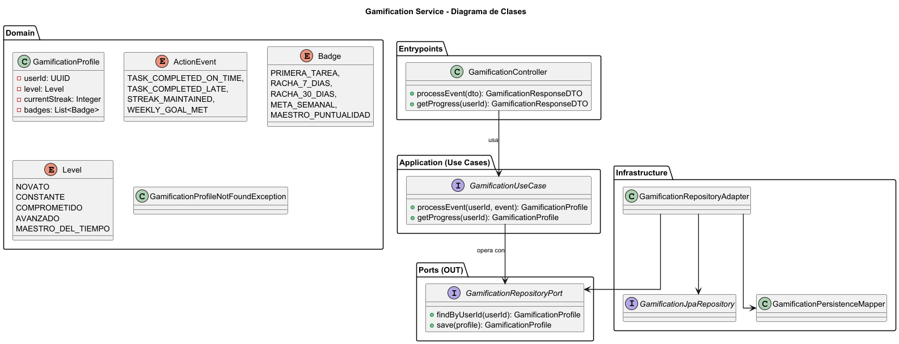
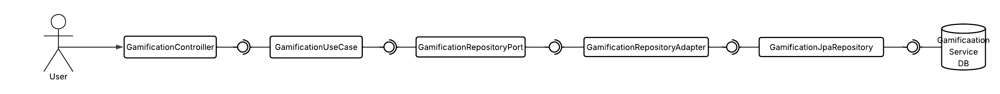

<div align="center">

# 🎮 AIBERT — Gamification Service

### *"Impulsando la motivación académica mediante mecánicas de gamificación"*

---

### 🛠️ Stack Tecnológico


### ☁️ Infraestructura & Calidad


### 🏗️ Arquitectura


</div>

---

## 📑 Tabla de Contenidos

1. [👤 Integrantes](#1--integrantes)
2. [🎯 Objetivo del Microservicio](#2--objetivo-del-microservicio)
3. [⚡ Funcionalidades Principales](#3--funcionalidades-principales)
4. [📋 Estrategia de Versionamiento y Branches](#4--manejo-de-estrategia-de-versionamiento-y-branches)
5. [⚙️ Tecnologías Utilizadas](#5--tecnologias-utilizadas)
6. [🧩 Funcionalidad](#6--funcionalidad)
7. [📊 Diagramas](#7--diagramas)
8. [⚠️ Manejo de Errores](#8--manejo-de-errores)
9. [🧪 Evidencia de Pruebas y Ejecución](#9--evidencia-de-las-pruebas-y-como-ejecutarlas)
10. [🗂️ Organización del Código](#10--codigo-de-la-implementacion-organizado-en-las-respectivas-carpetas)
11. [🚀 Ejecución del Proyecto](#11--ejecucion-del-proyecto)
12. [☁️ CI/CD y Despliegue en Azure](#12--evidencia-de-cicd-y-despliegue-en-azure)
13. [🤝 Contribuciones](#13--contribuciones)

---

## 1. 👤 Integrantes

- **Equipo:** Grootyology

---

## 2. 🎯 Objetivo del microservicio

El **Gamification Service** tiene como objetivo gestionar las funcionalidades de gamificación académica dentro de la plataforma AIBERT, registrando eventos de actividad del usuario y calculando su progreso, niveles y métricas asociadas.

Este microservicio busca incentivar la participación activa del estudiante, reforzando hábitos positivos mediante mecánicas de gamificación que se integran con otros módulos del sistema.

---

## 3. ⚡ Funcionalidades principales

<div align="center">

<table>
  <thead>
    <tr>
      <th>🧩 Funcionalidad</th>
      <th>Descripción</th>
    </tr>
  </thead>
  <tbody>
    <tr>
      <td><strong>Consulta de Progreso</strong></td>
      <td>Permite consultar el progreso académico gamificado del usuario.</td>
    </tr>
    <tr>
      <td><strong>Procesamiento de Eventos</strong></td>
      <td>Registra eventos de actividad académica para actualizar el progreso del usuario.</td>
    </tr>
  </tbody>
</table>

</div>

---

## 4. 📋 Manejo de Estrategia de versionamiento y branches

Para el desarrollo del **Gamification Service** se utiliza una estrategia de control de versiones basada en **Git Flow**, la cual permite mantener separadas las versiones estables del microservicio del desarrollo activo de nuevas mecánicas de gamificación.

Esta estrategia ha facilitado la implementación progresiva de funcionalidades relacionadas con el cálculo del progreso académico, el procesamiento de eventos y diversos ajustes técnicos realizados durante la evolución del módulo de gamificación.

### Estrategia de Ramas (Git Flow)

El repositorio maneja principalmente las siguientes ramas:

- `main`
- `develop`
- `feature/*`

El trabajo diario se ha concentrado principalmente en ramas `feature/*`, las cuales permiten desarrollar nuevas funcionalidades de forma aislada y reducir conflictos durante la integración.

### Ramas y propósito

#### `main`
- Contiene la versión estable del **Gamification Service**.
- Se utiliza como referencia para despliegues y demostraciones.
- No se realizan desarrollos directos sobre esta rama.
- Los cambios llegan a `main` únicamente después de haber sido integrados y validados en `develop`.

#### `develop`
- Rama utilizada para integrar las funcionalidades en desarrollo.
- Sirve como base para crear nuevas ramas `feature/*`.
- Permite validar de forma conjunta los cambios relacionados con la lógica de gamificación antes de considerarlos estables.

#### `feature/*`
- Ramas destinadas al desarrollo de funcionalidades específicas y tareas técnicas del microservicio.
- Se crean a partir de `develop` y se integran nuevamente mediante Pull Requests.
- Ejemplos de ramas utilizadas durante el desarrollo del Gamification Service:
    - `feature/dockerizacion`: contenedorización del microservicio para facilitar su despliegue.
    - `feature/gamification`: implementación y ajustes en la lógica de gamificación y cálculo de progreso.

Este enfoque permitió trabajar cada característica de forma independiente, facilitando su revisión y evitando interferencias entre cambios simultáneos.

### Flujo de trabajo general

1. Se crea una rama `feature/*` a partir de `develop`.
2. Se implementan los cambios asociados a una funcionalidad o mejora específica.
3. Se validan los cambios de forma local.
4. Se genera un Pull Request hacia `develop`.
5. Una vez consolidadas y probadas las funcionalidades, `develop` se integra en `main` para actualizar la versión estable del microservicio.

Este flujo ha permitido mantener un desarrollo ordenado, controlado y consistente a lo largo del ciclo de vida del **Gamification Service**.

---

## 5. ⚙️ Tecnologías Utilizadas

| Tecnología | Uso principal |
|----------|---------------|
| **Java 21** | Lenguaje base del microservicio |
| **Spring Boot** | Exposición de APIs REST |
| **Spring Data JPA** | Acceso y persistencia de datos de gamificación |
| **PostgreSQL** | Base de datos relacional |
| **Maven** | Gestión de dependencias |
| **Docker** | Contenerización |
| **GitHub Actions** | Integración continua |

---

## 6. 🧩 Funcionalidad

### 📊 Consulta de Progreso de Gamificación

Permite consultar el estado actual del progreso gamificado del usuario dentro del sistema AIBERT. Esta información incluye métricas internas de progreso académico utilizadas por el sistema de gamificación para reflejar la actividad del estudiante.

**Endpoint principal:**  
`GET /api/gamification/progress/{userId}`

---

### 📦 Estructura de la Solicitud (Request)

<div align="center">

| 🏷️ Campo | 🗃️ Tipo | ⚠️ Restricción | 📝 Descripción |
|---------|---------|:-------------:|---------------|
| userId | UUID | Obligatorio (Path) | Identificador único del usuario |

</div>

---

### 📦 Estructura de la Respuesta (Response)

<div align="center">

| 🏷️ Campo | 🗃️ Tipo | 📝 Descripción |
|---------|---------|---------------|
| level | Integer | Nivel actual de gamificación del usuario |
| experience | Integer | Experiencia acumulada |
| currentStreak | Integer | Racha actual de actividad |
| badges | List<String> | Insignias obtenidas por el usuario |

</div>

---

### 🎯 Procesamiento de Evento Académico

Permite registrar un evento académico asociado a un usuario, el cual es utilizado por el sistema para actualizar su progreso, racha y nivel dentro del módulo de gamificación.

Estos eventos representan acciones relevantes del estudiante, como completar tareas o actividades académicas.

**Endpoint principal:**  
`POST /api/gamification/event`

---

### 📦 Estructura de la Solicitud (Request)

<div align="center">

| 🏷️ Campo | 🗃️ Tipo | ⚠️ Restricción | 📝 Descripción |
|---------|---------|:-------------:|---------------|
| userId | UUID | Obligatorio | Identificador del usuario |
| eventType | String | Obligatorio | Tipo de evento académico |
| timestamp | LocalDateTime | Obligatorio | Fecha y hora del evento |

</div>

---

### 📦 Estructura de la Respuesta (Response)

<div align="center">

| 🏷️ Campo | 🗃️ Tipo | 📝 Descripción |
|---------|---------|---------------|
| message | String | Confirmación del procesamiento del evento |
| updatedLevel | Integer | Nivel actualizado del usuario |
| updatedExperience | Integer | Experiencia acumulada tras el evento |

</div>

---

## 7. 📊 Diagramas

---

### 🧱 Diagrama de Clases — Gamification Service

El diagrama de clases muestra la estructura interna del microservicio y cómo se modela el progreso académico del usuario siguiendo una arquitectura hexagonal dividida en capas de Entrypoints, Application, Domain e Infrastructure. Se observa cómo el `GamificationController` delega la consulta de progreso y el procesamiento de eventos al `GamificationUseCase`, el manejo de entidades de dominio como `GamificationProfile`, `ActionEvent`, `Level` y `Badge`, así como el acceso a persistencia mediante puertos y adaptadores desacoplados de la lógica de negocio.

<div align="center">



</div>

---

### 🧩 Diagrama de Componentes — Gamification Service

Este diagrama de secuencia representa el flujo de consulta del progreso de gamificación del usuario. El proceso inicia cuando el cliente solicita el progreso, el `GamificationController` delega la operación al `GamificationUseCase` y se consulta el perfil de gamificación a través del repositorio antes de construir y retornar la respuesta con la información actual del usuario.
<div align="center">



</div>

---

### 🔁 Diagrama de Secuencia — Consulta de Progreso

Este diagrama de secuencia representa el flujo de consulta del progreso de gamificación del usuario.

<div align="center">


</div>

---

### 🔁 Diagrama de Secuencia — Procesamiento de Evento

Este diagrama de secuencia describe el proceso completo de procesamiento de un evento académico. El flujo muestra cómo el `GamificationController` recibe el evento, el caso de uso aplica las reglas de gamificación sobre el perfil del usuario, se actualizan los valores de progreso y la información resultante es persistida y retornada como respuesta.

<div align="center">


</div>

---

## 8. ⚠️ Manejo de Errores

El **Gamification Service** implementa un mecanismo centralizado de manejo de errores con el fin de garantizar respuestas claras y consistentes durante el procesamiento de eventos académicos y la consulta del progreso de gamificación del usuario.

A través de un **manejador global de excepciones** (`@ControllerAdvice`), se interceptan errores tanto de validación como del dominio de negocio, evitando exponer información interna del sistema y manteniendo un formato de respuesta uniforme para el cliente.

Este enfoque permite que el frontend y los demás microservicios puedan manejar los errores de forma predecible y desacoplada de la implementación interna del servicio.

---

### 📊 Tipos de errores manejados

| Código HTTP | Escenario |
|------------|-----------|
| **400 Bad Request** | Datos inválidos en la petición o eventos académicos con información incorrecta. |
| **404 Not Found** | Perfil de gamificación no encontrado para el usuario solicitado. |
| **500 Internal Server Error** | Error inesperado durante el cálculo o actualización del progreso de gamificación. |

---

Cuando ocurre un error, el servicio retorna únicamente la información necesaria para que el cliente pueda reaccionar adecuadamente, sin revelar detalles internos del sistema, reforzando así las buenas prácticas de manejo de excepciones dentro de la plataforma **AIBERT**.

---

## 9. 🧪 Evidencia de Pruebas y Ejecución

El microservicio cuenta con pruebas unitarias sobre los flujos principales de gamificación.

```bash
mvn clean test
```

## 10. 🗂️ Organización del Código (Scaffolding)

El microservicio sigue una arquitectura hexagonal (puertos y adaptadores):

```
gamification-service/
│
├── 📁 src/
│   ├── 📁 main/
│   │   ├── 📁 java/
│   │   │   └── 📁 com/aibert/dosw/
│   │   │       ├── 📁 application/                # 🔵 CAPA DE APLICACIÓN
│   │   │       │   ├── 📁 dto/
│   │   │       │   │   ├── 📁 request/             # DTOs de entrada para eventos y consultas
│   │   │       │   │   └── 📁 response/            # DTOs de salida del progreso de gamificación
│   │   │       │   ├── 📁 mapper/                  # Mappers aplicación ↔ dominio
│   │   │       │   ├── 📁 service/                 # Servicios de aplicación
│   │   │       │   └── 📁 usecase.user             # Casos de uso de gamificación
│   │   │       │
│   │   │       ├── 📁 config/                      # ⚙️ CONFIGURACIONES
│   │   │       │
│   │   │       ├── 📁 domain/                      # 🟢 CAPA DE DOMINIO
│   │   │       │   ├── 📁 exceptions/              # Excepciones del dominio de gamificación
│   │   │       │   └── 📁 model/
│   │   │       │       ├── 📁 user/                # Entidades de gamificación del usuario
│   │   │       │       └── 📁 valueObjects/        # Value Objects (Level, Badge, ActionEvent)
│   │   │       │
│   │   │       ├── 📁 ports/                       # Puertos In / Out
│   │   │       │   ├── 📁 in/                      # Interfaces de casos de uso
│   │   │       │   └── 📁 out/                     # Interfaces de persistencia
│   │   │       │
│   │   │       ├── 📁 entrypoints/                 # 🔴 CAPA DE ENTRADA
│   │   │       │   ├── 📁 advice/                  # Manejo global de errores
│   │   │       │   └── 📁 rest/
│   │   │       │       ├── 📁 controller/           # GamificationController
│   │   │       │       └── 📁 mapper/               # Mappers REST ↔ aplicación
│   │   │       │
│   │   │       ├── 📁 infrastructure/              # 🟠 CAPA DE INFRAESTRUCTURA
│   │   │       │   ├── 📁 adapters/
│   │   │       │   │   └── 📁 adapter/              # Implementaciones de los puertos
│   │   │       │   └── 📁 persistence/
│   │   │       │       ├── 📁 entity/               # Entidades JPA
│   │   │       │       ├── 📁 mapper/               # Mapeadores dominio ↔ persistencia
│   │   │       │       └── 📁 repository/           # Repositorios JPA
│   │   │       │
│   │   │       ├── 📁 external.email                # Integración con servicios externos
│   │   │       │
│   │   │       └── GamificationServiceApplication # Punto de arranque Spring Boot
│   │   │
│   │   └── resources/                            # application.yml
│   │
│   └── test/                                     # 🧪 PRUEBAS UNITARIAS
│
└── pom.xml                                       # Configuración Maven
```

---

## 11. 🚀 Ejecución del Proyecto

### 📋 Prerrequisitos
- **Java 21**
- **Maven 3.8+**
- **Docker** (Opcional)

### 🛠️ Opción 1: Ejecución Local (Maven)

```bash
mvn spring-boot:run
```
📍 **URL Local:** `http://localhost:8080` (o el puerto configurado)  
📚 **Documentación API (Swagger):** `http://localhost:8080/swagger-ui.html`

### 🐳 Opción 2: Ejecución con Docker (Si se incluye Dockerfile)

```bash
docker-compose up --build -d
```

---

## 12. ☁️ CI/CD y Despliegue en Azure

El proyecto tiene capacidad para desplegarse mediante GitHub Actions hacia Azure App Service o un entorno contenedorizado en la nube.
Se definen perfiles como `dev` y `prod` en `application.yml` para gestionar la cadena de conexión de MongoDB y las keys de Gemini/Groq.

---

## 13. 🤝 Contribuciones

### Metodología
Se utiliza **Scrum** con iteraciones cortas, asegurando entregas continuas y mejora de valor. Las ramas principales son protegidas y todos los PRs deben cumplir validación estática (SonarQube) y ejecutar pipelines de CI.

<div align="center">

### 🏆 Proyecto AIBERT


</div>