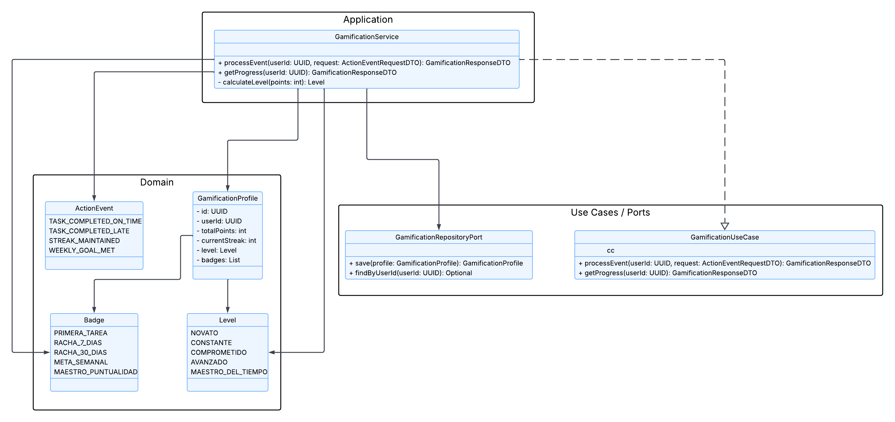
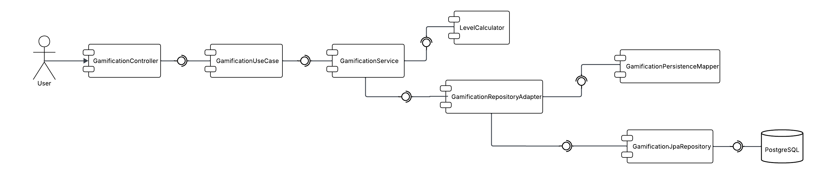
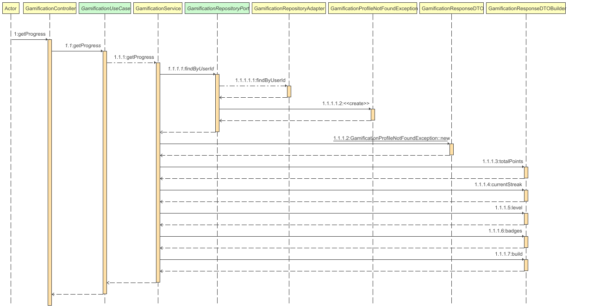
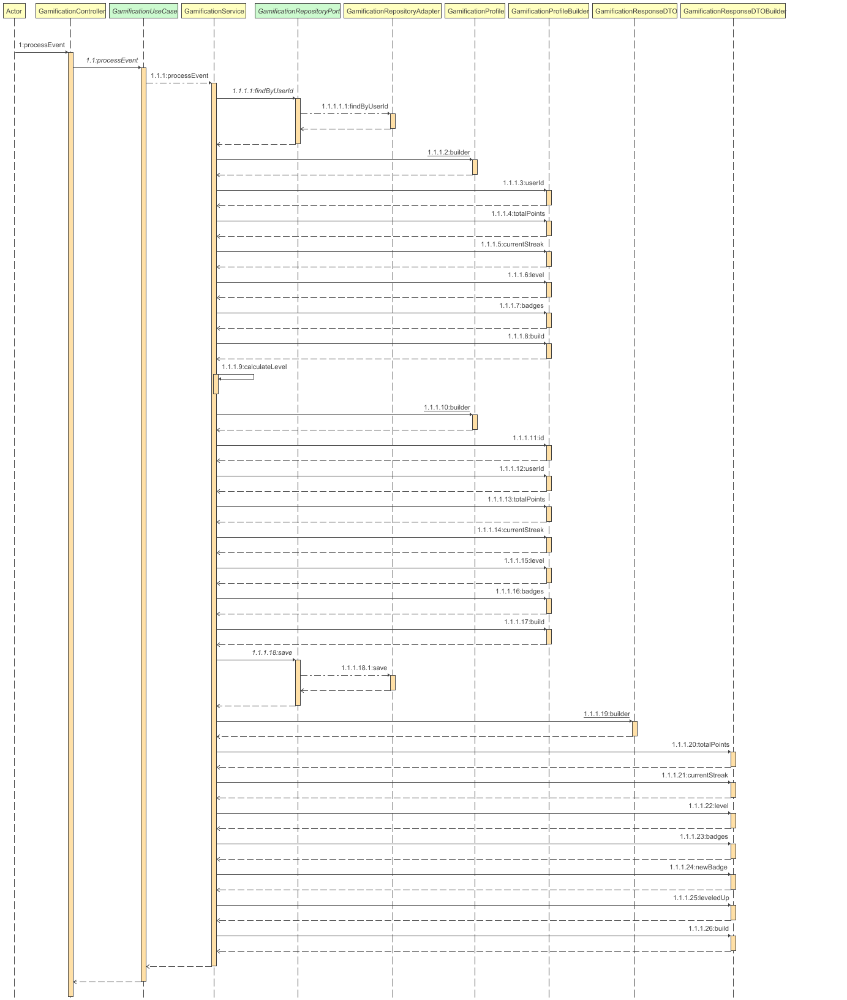

<div align="center">

# AIBERT - Gamification Service

### "Impulsando la motivacion academica mediante mecanicas de gamificacion"

---

### Stack Tecnologico


### Infraestructura y Calidad


### Arquitectura


</div>

---

## Tabla de Contenidos

1. [Integrantes](#1--integrantes)
2. [Objetivo del Microservicio](#2--objetivo-del-microservicio)
3. [Funcionalidades Principales](#3--funcionalidades-principales)
4. [Estrategia de Versionamiento y Branches](#4--manejo-de-estrategia-de-versionamiento-y-branches)
5. [Tecnologias Utilizadas](#5--tecnologias-utilizadas)
6. [Funcionalidad](#6--funcionalidad)
7. [Diagramas](#7--diagramas)
8. [Manejo de Errores](#8--manejo-de-errores)
9. [Evidencia de Pruebas y Ejecucion](#9--evidencia-de-las-pruebas-y-como-ejecutarlas)
10. [Organizacion del Codigo](#10--codigo-de-la-implementacion-organizado-en-las-respectivas-carpetas)
11. [Ejecucion del Proyecto](#11--ejecucion-del-proyecto)
12. [CI/CD y Despliegue en Azure](#12--evidencia-de-cicd-y-despliegue-en-azure)
13. [Contribuciones](#13--contribuciones)

---

## 1. Integrantes

- **Equipo:** Grootyology

---

## 2. Objetivo del microservicio

El **Gamification Service** gestiona la gamificacion academica de AIBERT.  
Procesa eventos del estudiante, calcula puntajes y rachas, desbloquea logros y
mantiene visualizacion de progreso por materia para integracion con otros
microservicios de la plataforma.

---

## 3. Funcionalidades principales

<div align="center">

<table>
  <thead>
    <tr>
      <th>Funcionalidad</th>
      <th>Descripcion</th>
    </tr>
  </thead>
  <tbody>
    <tr>
      <td><strong>AIB-36 Points</strong></td>
      <td>Otorga XP por eventos academicos, actualiza puntos totales y racha.</td>
    </tr>
    <tr>
      <td><strong>AIB-37 Achievements</strong></td>
      <td>Evalua condiciones de desbloqueo y construye la galeria de logros.</td>
    </tr>
    <tr>
      <td><strong>AIB-38 Subject Progress</strong></td>
      <td>Calcula progreso por materia, nivel, XP y estado visual.</td>
    </tr>
  </tbody>
</table>

</div>

---

## 4. Manejo de Estrategia de versionamiento y branches

Para el desarrollo del **Gamification Service** se utiliza una estrategia de
control de versiones basada en **Git Flow**, manteniendo separadas las versiones
estables del desarrollo activo.

### Estrategia de Ramas (Git Flow)

Ramas principales:

- `main`
- `develop`
- `feature/*`

### Ramas y proposito

#### `main`
- Version estable de referencia para despliegues productivos.

#### `develop`
- Rama de integracion para validar cambios funcionales y tecnicos.

#### `feature/*`
- Desarrollo de funcionalidades puntuales mediante Pull Requests hacia `develop`.

### Flujo de trabajo general

1. Crear rama `feature/*` desde `develop`.
2. Implementar cambios y validar localmente.
3. Abrir Pull Request hacia `develop`.
4. Ejecutar pipeline de CI.
5. Promover `develop` a `main` para version estable.

---

## 5. Tecnologias Utilizadas

| Tecnologia | Uso principal |
|----------|---------------|
| **Java 21** | Lenguaje base del microservicio |
| **Spring Boot** | API REST |
| **Spring Data JPA** | Persistencia relacional |
| **Spring Security + JWT** | Filtro de autenticacion por token |
| **MapStruct** | Mapeo DTO <-> dominio <-> persistencia |
| **PostgreSQL** | Base de datos principal |
| **H2** | Base de datos en pruebas |
| **Maven** | Build y dependencias |
| **Docker** | Contenerizacion |
| **GitHub Actions** | CI/CD |

---

## 6. Funcionalidad

### 6.1 Sistema de Puntos (AIB-36)

**Endpoints:**

- `POST /api/v1/gamification/{userId}/points/events`
- `GET /api/v1/gamification/{userId}/points`

**Request principal (`POST /points/events`):**

| Campo | Tipo | Restriccion | Descripcion |
|------|------|------------|-------------|
| `actionEvent` | Enum | Obligatorio | Tipo de evento academico |
| `completionDate` | LocalDateTime | Obligatorio | Fecha de ocurrencia |
| `dueDate` | LocalDateTime | Opcional | Fecha limite para bono de puntualidad |
| `activityId` | UUID | Opcional | Identificador unico para deduplicacion |
| `userActivityHistory` | List | Obligatorio | Historial para validar duplicados |

**Response principal:**

| Campo | Tipo | Descripcion |
|------|------|-------------|
| `totalPoints` | Integer | XP global acumulado |
| `xpEarned` | Integer | XP obtenido en el evento |
| `currentStreak` | Integer | Racha de productividad |
| `pointsUpdated` | Boolean | Indica si hubo actualizacion |
| `message` | String | Mensaje funcional FA-* cuando aplica |

---

### 6.2 Sistema de Logros (AIB-37)

**Endpoints:**

- `POST /api/v1/gamification/{userId}/achievements/unlock`
- `GET /api/v1/gamification/{userId}/achievements`

**Request principal (`POST /achievements/unlock`):**

| Campo | Tipo | Restriccion | Descripcion |
|------|------|------------|-------------|
| `achievementEvent` | Enum | Obligatorio | Evento de logro a evaluar |
| `userProgressData` | List | Obligatorio | Datos de progreso del estudiante |
| `unlockDate` | LocalDateTime | Opcional | Fecha de desbloqueo (si no se envia, usa actual) |

**Response principal:**

| Campo | Tipo | Descripcion |
|------|------|-------------|
| `username` | String | Usuario propietario del perfil |
| `achievementUnlocked` | Boolean | Resultado del intento de unlock |
| `achievementBadge` | Object | Insignia desbloqueada (si aplica) |
| `achievementGallery` | List | Galeria completa (locked/unlocked) |
| `recentAchievements` | List | Ultimos logros desbloqueados |
| `message` | String | Mensaje funcional FA-* cuando aplica |

---

### 6.3 Progreso por Materia (AIB-38)

**Endpoints:**

- `POST /api/v1/gamification/{userId}/subjects/progress`
- `GET /api/v1/gamification/{userId}/subjects/progress`
- `GET /api/v1/gamification/{userId}/subjects/{subjectId}/progress`

**Request principal (`POST /subjects/progress`):**

| Campo | Tipo | Restriccion | Descripcion |
|------|------|------------|-------------|
| `subjects` | List | Obligatorio, no vacio | Lote de materias para calcular |
| `subjectId` | String | Obligatorio | Id de materia |
| `completedTasks` | List | Obligatorio | Tareas completadas |
| `totalTasks` | Integer | Opcional | Total de tareas de referencia |
| `xpEarned` | Integer | Opcional | XP informado por sistema origen |
| `academicPerformance` | Float | Obligatorio | Desempeno academico (0-100) |

**Response principal:**

| Campo | Tipo | Descripcion |
|------|------|-------------|
| `userName` | String | Usuario propietario |
| `userGlobalLevel` | Enum | Nivel global del estudiante |
| `totalGlobalXp` | Integer | XP global acumulado |
| `subjects` | List | Items calculados por materia |

---

### 6.4 Seguridad y observabilidad

- `OpenAPI/Swagger`: `/swagger-ui/index.html`
- `OpenAPI JSON`: `/v3/api-docs`
- `Health check`: `/actuator/health`
- Filtro JWT implementado en `JwtAuthFilter`.
- Nota de estado actual: la autorizacion de endpoints esta en modo abierto para pruebas temporales.

---

## 7. Diagramas

---

### Diagrama de Clases Gamification Service

El diagrama de clases muestra la estructura interna del microservicio y como se modela el progreso academico del usuario siguiendo una arquitectura hexagonal dividida en capas de Entrypoints, Application, Domain e Infrastructure. Se observa como el `GamificationController` delega la consulta de progreso y el procesamiento de eventos al `GamificationUseCase`, el manejo de entidades de dominio como `GamificationProfile`, `ActionEvent`, `Level` y `Badge`, asi como el acceso a persistencia mediante puertos y adaptadores desacoplados de la logica de negocio.

<div align="center">



</div>

---

### Diagrama de Componentes Gamification Service

Este diagrama de secuencia representa el flujo de consulta del progreso de gamificacion del usuario. El proceso inicia cuando el cliente solicita el progreso, el `GamificationController` delega la operacion al `GamificationUseCase` y se consulta el perfil de gamificacion a traves del repositorio antes de construir y retornar la respuesta con la informacion actual del usuario.
<div align="center">



</div>

---

### Diagrama de Secuencia - Consulta de Progreso

Este diagrama de secuencia representa el flujo de consulta del progreso de gamificacion del usuario.

<div align="center">



</div>

---

### Diagrama de Secuencia - Procesamiento de Evento

Este diagrama de secuencia describe el proceso completo de procesamiento de un evento academico. El flujo muestra como el `GamificationController` recibe el evento, el caso de uso aplica las reglas de gamificacion sobre el perfil del usuario, se actualizan los valores de progreso y la informacion resultante es persistida y retornada como respuesta.

<div align="center">



</div>

---

## 8. Manejo de Errores

El servicio usa un manejador global (`GlobalExceptionHandler`) que normaliza las
respuestas de error en formato:

```json
{
  "code": "GAM-400",
  "message": "Invalid request payload",
  "timestamp": "2026-05-17T00:00:00Z",
  "path": "/api/v1/..."
}
```

### Codigos implementados

| Codigo | HTTP | Escenario |
|-------|------|-----------|
| `GAM-400` | 400 | Validacion de payload / formato |
| `GAM-404` | 404 | Perfil de gamificacion no encontrado |
| `GAM-405` | 404 | No hay materias registradas |
| `GAM-406` | 404 | Progreso de materia no encontrado |
| `GAM-422` | 422 | Datos academicos invalidos |
| `GAM-500` | 500 | Falla al actualizar puntos |
| `GAM-501` | 500 | Falla al actualizar logros |
| `GAM-502` | 500 | Falla al cargar progreso por materia |
| `GAM-503` | 500 | Error interno no controlado |

---

## 9. Evidencia de Pruebas y Ejecucion

### Pruebas automatizadas

Ejecutar suite de pruebas:

```bash
./mvnw test
```

Cobertura:

```bash
./mvnw jacoco:report
```

### Pruebas manuales de endpoints (agregadas)

Se agrego un set completo de pruebas manuales para todos los endpoints:

- `docs/testing/ENDPOINT_TEST_PLAN.md`
- `docs/testing/endpoints.http`

Incluye casos:

- Happy path
- Validaciones (`400`)
- No encontrados (`404`)
- Duplicados funcionales (`FA-02`, `FA-04`)

---

## 10. Organizacion del Codigo (Scaffolding)

El microservicio sigue arquitectura hexagonal (puertos y adaptadores):

```text
gamification-service/
|-- src/
|   |-- main/
|   |   |-- java/com/aibert/dosw/
|   |   |   |-- application/
|   |   |   |   |-- dto/request
|   |   |   |   |-- dto/response
|   |   |   |   |-- mapper
|   |   |   |   `-- service
|   |   |   |-- config
|   |   |   |-- domain/
|   |   |   |   |-- exceptions
|   |   |   |   |-- model
|   |   |   |   |-- ports/in
|   |   |   |   |-- ports/out
|   |   |   |   `-- service
|   |   |   |-- entrypoints/
|   |   |   |   |-- advice
|   |   |   |   `-- rest/controller
|   |   |   `-- infrastructure/adapters/
|   |   |       |-- adapter
|   |   |       `-- persistence/
|   |   |           |-- entity
|   |   |           |-- mapper
|   |   |           `-- repository
|   |   `-- resources/application.yml
|   `-- test/
|       `-- java/com/aibert/dosw/...
|-- docs/
|   |-- uml/
|   `-- testing/
|       |-- ENDPOINT_TEST_PLAN.md
|       `-- endpoints.http
|-- Dockerfile
|-- docker-compose.yml
`-- pom.xml
```

---

## 11. Ejecucion del Proyecto

### Prerrequisitos

- Java 21
- Maven 3.9+
- Docker (opcional)

### Opcion 1: Ejecucion local (Maven Wrapper)

```bash
./mvnw spring-boot:run -Dspring-boot.run.profiles=local
```

URLs:

- API local: `http://localhost:8080`
- Swagger UI: `http://localhost:8080/swagger-ui/index.html`
- Health: `http://localhost:8080/actuator/health`

### Opcion 2: Ejecucion con Docker Compose

```bash
docker compose up --build -d
```

Puertos por defecto en compose:

- API: `http://localhost:8084`
- PostgreSQL: `localhost:5436`

Variables relevantes (via `.env`):

- `DB_NAME`
- `DB_USER`
- `DB_PASSWORD`
- `DB_URL`
- `JWT_SECRET`
- `SPRING_PROFILES_ACTIVE` (default en compose: `qa`)

---

## 12. CI/CD y Despliegue en Azure

Pipeline definido en `.github/workflows/ci_gamification-service.yml`:

1. **compile**: compila con JDK 21.
2. **test**: ejecuta pruebas y publica resultados.
3. **analyze**: genera reporte JaCoCo y analisis SonarCloud.
4. **build**: construye y publica imagen en GHCR (ramas `develop` y `main`).
5. **deploy-qa**: despliegue a Azure Container Apps QA (`develop`).
6. **deploy-prod**: despliegue a Azure Container Apps PROD (`main`).

---

## 13. Contribuciones

### Metodologia

Se trabaja con Scrum e integracion continua:

- ramas protegidas
- Pull Requests obligatorios
- ejecucion de pruebas en CI
- analisis de calidad automatizado

<div align="center">

### Proyecto AIBERT


</div>
